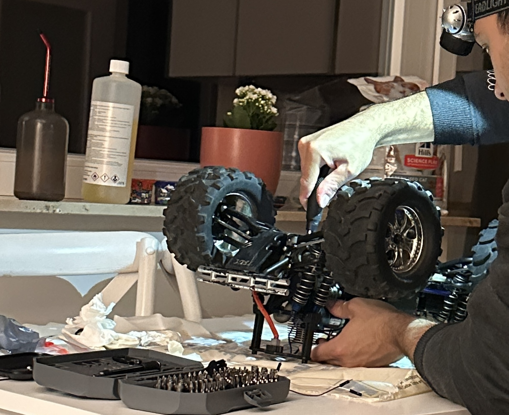

# Log – Traxxas T-Maxx 2.5 Repair & First Startup  
**Date:** 12 August, 2025  
**Stage:** Restoration & Pre-Telemetry Setup  
---

## Overview

Before I started adding telemetry hardware, I had to bring my **Traxxas T-Maxx 2.5** back to life.  
I bought it as a **salvage truck** — it hadn’t run in years, came with missing screws, cracked plastics, burned electronics, and a completely seized engine.  
This log covers the rebuild journey: from a dead nitro truck to a running platform ready for embedded upgrades.

---

## 🧩 First Look

When I first picked it up, the truck looked tired:
- The **TRX 2.5** engine had zero compression.  
- **Servos** were fried beyond repair.  
- The carburetor was completely gummed up.  
- Fuel lines were brittle, and many screws and hinge pins were missing.  
- The chassis was layered with oil and dust from years of sitting.

  

---

## 🔧 The Rebuild

I tore everything down to the bare chassis and slowly brought it back piece by piece.

### Engine Work
- Disassembled and deep-cleaned the **TRX 2.5** engine and carburetor.  
- Replaced **glow plug, gaskets, and O-rings**, and re-tuned all needles to factory specs.  
- Installed new **fuel lines** and a clean air filter.  
- After a few hard pulls and adjustments, it finally roared back to life.  

### Electronics
- Swapped in new servos for throttle and steering.  
- Rewired all power leads with fresh solder joints.  
- Cleaned up cable routing for easier future sensor integration.

### Chassis & Drivetrain
- Cleaned every component, replaced worn screws and pins.  
- Rebuilt the shocks with fresh oil and ensured proper suspension travel.  
- Reassembled everything with thread-lock and checked alignment.

  

---

## 🏎️ First Startup

The first start after the rebuild was one of those moments you don’t forget.  
It sputtered a bit at first, then settled into a stable idle after a few needle tweaks.  
The TRX 2.5 ran beautifully, loud and smoky in all the right ways.  

> After years of silence, hearing that engine scream again was the spark for this whole telemetry project.
---

## 🧠 Notes & Takeaways

- These small nitro engines are far tougher than they look — a bit of patience and fresh seals can bring almost any TRX back.  
- The biggest issues came from **bad carb seals** and **fuel leaks**, not compression.  
- Cleaning and rewiring everything from scratch saved hours of debugging later.  
- There’s something satisfying about bringing an old machine back to life — it reminds me why I love building things from the ground up.  
- This rebuild phase was a good warm-up for the real embedded work ahead — sensors, power systems, and data all rely on the same patience and precision.

---

*End of log.*
