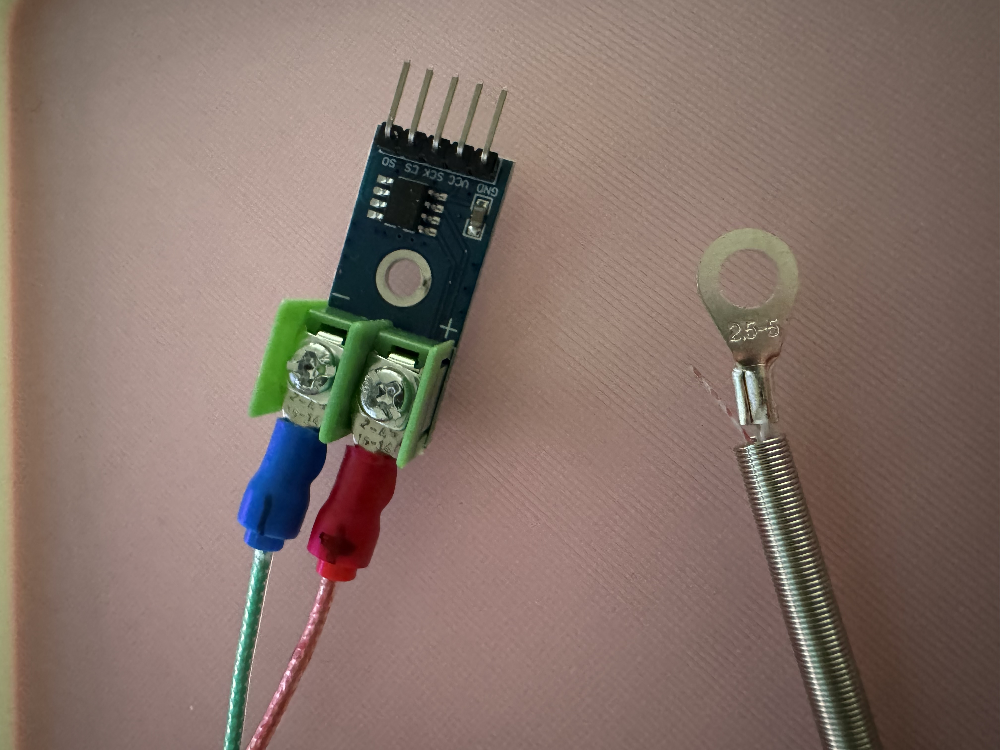
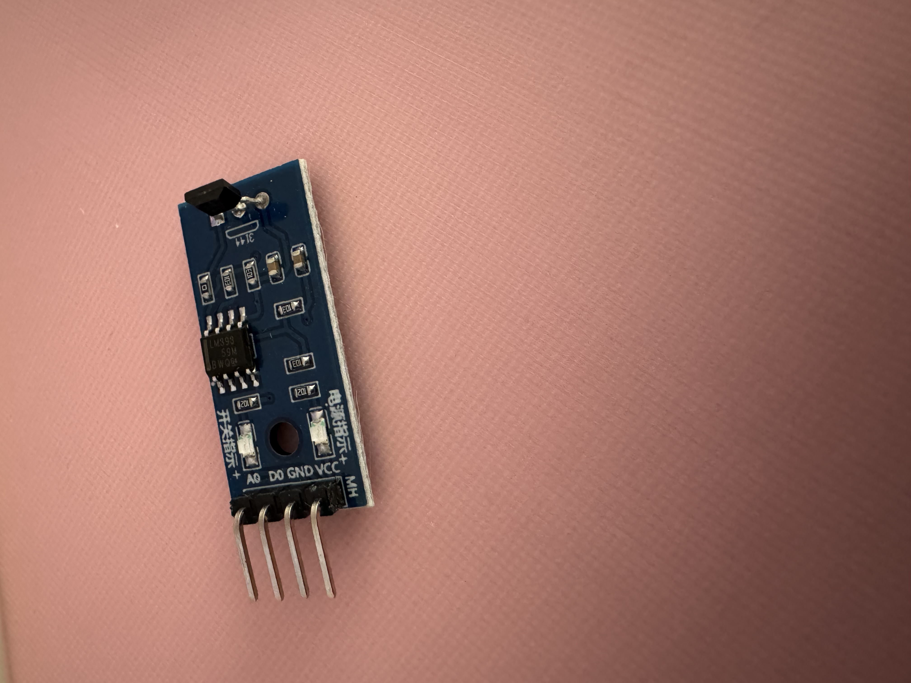

# Log 2 - Testing Sensors
** Date: ** 17 October 2025

## Overview
Sensors delivered yesterday so I tested all of them. Here is the list of the sensors and their job:

    MAX6675 + K-type Thermocouple – measures engine head temperature.
    Hall Effect RPM Sensor (A3144) – detects wheel or clutch rotation for RPM measurement.
	MPU6050 – tracks acceleration, tilt, and vibration.
	Tilt Sensor (SW-520D) – simple digital switch for rollover or motion detection. (Not sure to use it. MPU6050 seems enough but will consider later.)

## Summary
- MAX6675 seems working very stable and accurate, only tested on the desk. So I don't know the performance on the hugh temperatures.
    
 

- RPM Sensor is the most exciting one in my opinion. Also tested on the desk. Not sure it'll catch the 40.000 RPM but tested enougly around 4000 (Which is nothing)

    
- MPU6050 works great — very responsive to movement, tilt, and vibrations.  
  It should give solid orientation and motion data for the car once integrated into the telemetry system.  

- Tilt Sensor (SW-520D) works as expected but feels redundant next to the MPU6050.  
  Still, it might be useful later as a simple rollover or crash-detection input. 
## Steps Performed
1. Connected each sensor to Arduino UNO for bench testing.
2. Verified data output through Serial Monitor.
3. Compared sensor behavior under idle and active conditions.

## Observations / Results
- **MAX6675:** stable readings between **2–36 °C** at room temperature, no signal dropouts, reacts quickly to heat.  
- **RPM Sensor:** outputs clean digital pulses; response consistent up to simulated **~4000 RPM**; higher RPM capability untested.  
- **MPU6050:** all axes respond well to movement and tilt; baseline drift is minimal during short tests.
- **Tilt Sensor (SW-520D):** basic digital trigger works but seems redundant since MPU6050 already provides tilt detection.
