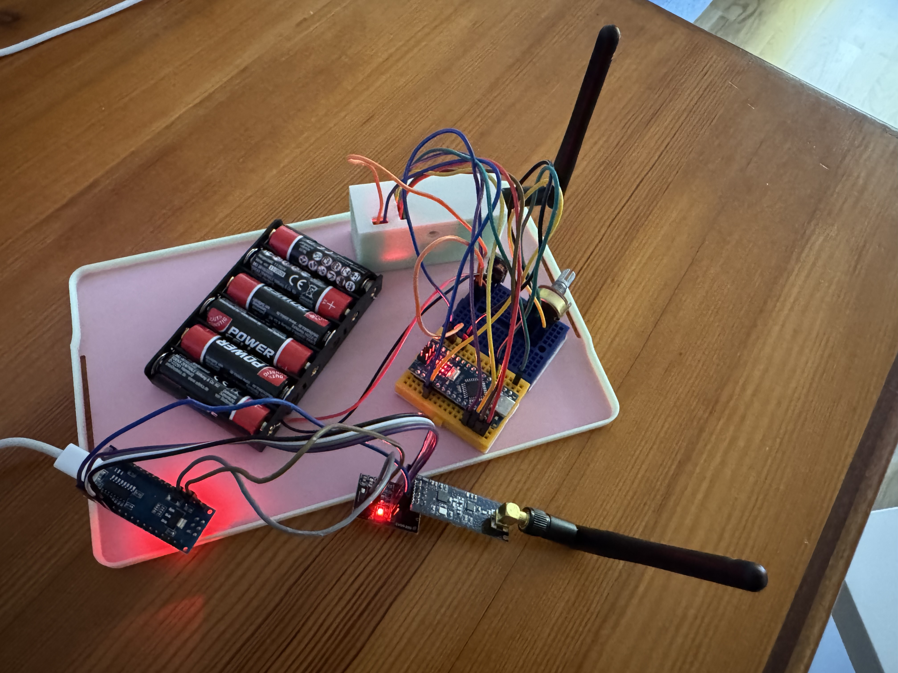
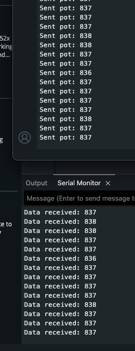

# nRF24L01 Potentiometer Telemetry Test

This example demonstrates basic wireless data transmission between two Arduino Nano boards using nRF24L01+ transceiver modules.
A potentiometer connected to the transmitter sends its analog value to the receiver, which displays the incoming readings through the serial monitor.

This test serves as a foundational example for sensor-to-telemetry communication, used in the RC Telemetry System project.

# Features

  Reads analog potentiometer input (0–1023)
	Sends data wirelessly via nRF24L01+ using RF24 library
	Displays received values in real time
	Configurable data rate, channel, and power level
	Provides a simple structure for future sensor data packets

# Hardware Used

| Component | Quantity | Description |
|------------|-----------|-------------|
| Arduino Nano | 2 | One transmitter, one receiver |
| nRF24L01+ Module | 2 | 2.4 GHz wireless transceiver modules |
| nRF24L01 Adapter Board | 2 | Regulates 5 V → 3.3 V |
| Potentiometer (10 kΩ) | 1 | Used as analog input for the TX |

## Wiring

### Common (TX & RX)
| nRF24L01+ Pin | Arduino Nano Pin | Notes |
|----------------|------------------|--------|
| **VCC** | **5V** | Use adapter’s 5 V input (built-in regulator) |
| **GND** | **GND** | Common ground between both boards |
| **CE** | **D9** | Chip Enable control |
| **CSN (CS)** | **D10** | SPI Chip Select |
| **SCK** | **D13** | SPI Clock |
| **MOSI** | **D11** | SPI Data from Nano |
| **MISO** | **D12** | SPI Data to Nano |
| **IRQ** | *Not connected* | Optional interrupt pin |

### Potentiometer (Transmitter side only)
| Potentiometer Pin | Arduino Nano Pin |
|--------------------|------------------|
| **Left** | **5V** |
| **Middle (Wiper)** | **A1** |
| **Right** | **GND** |

## Next Stage – Planned Tests & Improvements

After initial testing, communication between modules is mostly functional, but several issues still need to be verified and improved.
Here’s what I’ll focus on in the next stage:
	•	Power Stability Testing:
I’ll re-test the modules using a dedicated 5 V supply with a 100 µF capacitor on each nRF24 adapter to ensure stable ACK responses and reduce packet loss.
	•	Signal Reliability Optimization:
Plan to test multiple configurations for data rate, channel, and power level (e.g. 1 Mbps vs 250 Kbps, channel 76 vs 108) to find the most stable setup in indoor and outdoor conditions.
	•	Auto-ACK and Retry Behavior:
I’ll experiment with different retry delays and counts (setRetries() values) to minimize missed acknowledgements and evaluate how the modules behave at longer distances.

